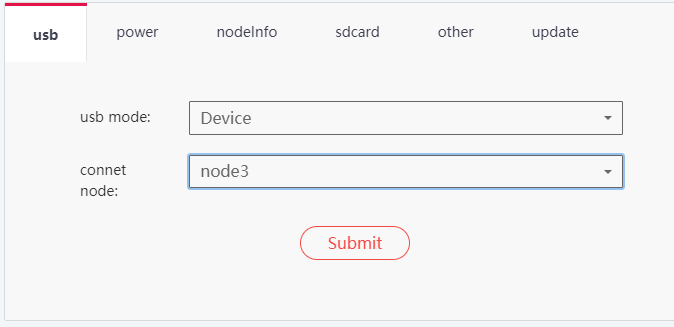
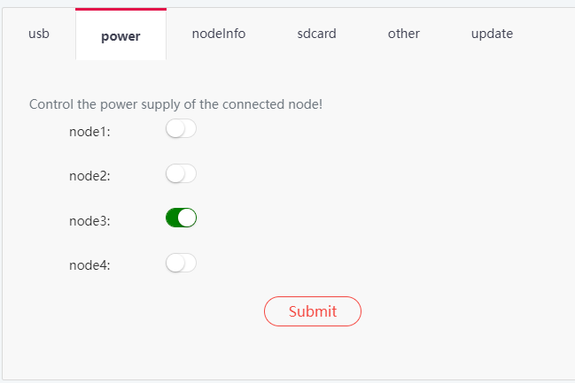

I did the following using Jetson Nano modules (version number [900-13448-0020-000](https://www.arrow.com/en/products/900-13448-0020-000/nvidia)) with a Turing Pi 2.

I used a dual booting laptop configured with Ubuntu 18.04 and Windows 10. 

I installed the [Nvidia SDK Manager](https://developer.nvidia.com/sdk-manager) while running Ubuntu 18.04 on the laptop.

My unsuccessful experience using slots 1 and 2 on the Turing Pi 2 was consistent with others. So I flashed each of the Nanos in slot 3, using the following steps. 

  
Using the Turing Pi 2 UI, I configured the USB OTG port to connect with Node 3.

I used a [USB type A to type A cable](https://www.amazon.com/gp/product/B0B3TNSXQQ) to connect the Turing Pi 2 USB OTG port to a USB port on the laptop.

  
Using the Turing Pi 2 UI, I powered Node 3 on. 

On the laptop, I started the Nvidia SDK Manager and the device was recognized.

I selected JetPack 4.6.2 with which to flash the Nanos. For expedience and a desire to reduce the number of variables at play, I deselected the additional modules, keeping on the base JetPack.

After the SDK manager reported success (this took a while), I powered the newly flashed Nano off and on again, using the Turing Pi UI. 

Once the Nano showed up on my network with the hostname 'ubuntu', I ssh'd into it and finished configuration (e.g. hostnamectl -sethostname). 

I then powered the slot down again with the Turing Pi UI, moved the Nano to its destination slot, and powered the Nano in its new slot. 

Then I started again with the next Nano. 